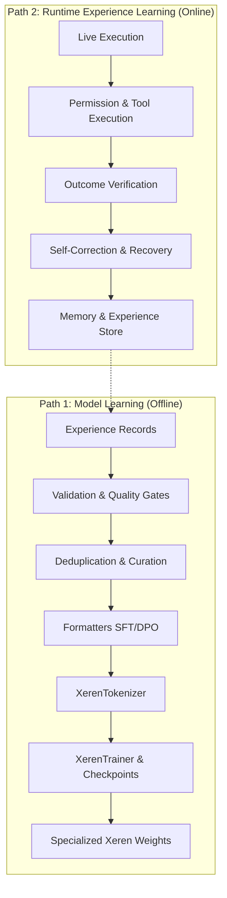

# Xeren Training Data & Model Learning Pipeline

This document defines the training data architecture, curation standards, and model-training pipeline for specialized Xeren agent models.

---

## 1. Two Distinct Learning Paths

Xeren implements two complementary learning mechanisms:



1. **Model Learning (Weights & Policies)**:
   - Fine-tunes specialized open-weight models (e.g. Qwen2.5-Coder, Llama-3) to internalize Xeren's agent loop, tool selection protocols, concise reasoning, and empirical self-verification.
   - Flow: `Training Data → Tokenizer → Base Model → Trainer → Evaluation → Specialized Weights`.

2. **Runtime Experience Learning (Context & Memory)**:
   - Ephemeral and long-term memory capturing execution outcomes, test verification, user feedback, and recovery trajectories.
   - Enables fast runtime adaptation without immediate weight updates.

---

## 2. Core Loop & Data Format

The Xeren agent loop is structured as follows:

$$\text{Intent} \longrightarrow \text{Understanding} \longrightarrow \text{Planning} \longrightarrow \text{RAG/Context} \longrightarrow \text{Tool Action} \longrightarrow \text{Observation} \longrightarrow \text{Verification} \longrightarrow \text{Outcome}$$

### Supported Training Representations

| Target Format | Class / Target | Use Case |
|---|---|---|
| **SFT ChatML** | `SFTChatExample` | Standard multi-turn Supervised Fine-Tuning for chat instruction models. |
| **Structured Agent** | `StructuredAgentExample` | Specialized sequence with token markers (`<|plan|>`, `<|action|>`, `<|observation|>`, `<|verification|>`). |
| **DPO Preference** | `DPOExample` | Direct Preference Optimization using chosen trajectory vs rejected alternatives. |

---

## 3. Data Schema & Anti-Contradiction Gates

All agent experiences are captured as `ExperienceRecord` objects (`src/xeren/data/schema.py`).

### Anti-Contradiction Rules:
1. **Success vs. Failure Reason**:
   - If `success=True`, `failure_reason` must be `None`.
   - If `success=False`, a non-empty `failure_reason` is required.
2. **Success vs. Verification**:
   - If `success=True`, `verification.verified` must be `True`.
   - If `verification.verified=True`, `verification.score` must be $\ge 0.5$.
3. **Trajectory Consistency**:
   - Action steps must have consecutive indices: `step_index = 0, 1, 2, ...`.
   - Trajectories where all actions failed cannot be marked `success=True`.
4. **Positive Imitation Safety**:
   - Failed trajectories (`success=False`) are **never** included in positive Supervised Fine-Tuning.
   - Failed trajectories are only used for self-correction learning or as rejected pairs in DPO preference optimization.
5. **Curation & Review Status**:
   - Every record carries a `review_status` (`approved`, `pending`, `rejected`, `flagged_for_review`).
   - Only `approved` records are accepted for model training.

---

## 4. Pipeline Execution Workflow

The end-to-end data pipeline is orchestrated by `TrainingDataPipeline` (`src/xeren/data/pipeline.py`):

```python
from xeren.data.dataset import load_jsonl_dataset
from xeren.data.pipeline import TrainingDataPipeline

# Load dataset
dataset = load_jsonl_dataset("data/train.jsonl")

# Initialize pipeline with strict verification
pipeline = TrainingDataPipeline(
    min_quality_score=0.7,
    require_verified=True,
    allow_failures=False,
)

# Export curated training artifacts
manifest = pipeline.export_training_artifacts(
    dataset=dataset,
    output_dir="artifacts/training_data",
    export_sft=True,
    export_dpo=True,
    export_structured=True,
)

print(f"Exported {manifest.sft_examples_exported} SFT examples.")
```

---

## 5. Model Training Subsystem

Located in `src/xeren/models/`:

- **`TrainingConfig`**: Hyperparameters (`learning_rate`, `batch_size`, `gradient_accumulation_steps`, `max_seq_length`, `epochs`, `seed`).
- **`XerenTokenizer`**: Tokenizer with special agent tokens (`<|im_start|>`, `<|plan|>`, `<|action|>`, `<|observation|>`, `<|verification|>`) and causal LM prompt loss masking (`-100`).
- **`CheckpointManager`**: Atomic checkpoint saving, `best_checkpoint` tracking, and automatic historical checkpoint pruning (`save_total_limit`).
- **`DataCollatorForCausalLM`**: Dynamic sequence padding with `-100` label masking.
- **`XerenTrainer`**: Training loop with:
  - `verify_readiness(train_dataset, val_dataset)`: Pre-flight dry-run testing configuration, tokenizer, batching, directory writeability, and data distribution without invoking heavy GPUs.
  - `train(train_dataset, val_dataset)`: Executes training, evaluation, and checkpoint saving.

### Pre-Flight Verification Dry-Run:

```python
from xeren.data.dataset import load_jsonl_dataset
from xeren.models.trainer import XerenTrainer
from xeren.models.training_config import TrainingConfig

train_ds = load_jsonl_dataset("data/train.jsonl")
val_ds = load_jsonl_dataset("data/val.jsonl")

trainer = XerenTrainer(config=TrainingConfig(epochs=3, batch_size=2))
report = trainer.verify_readiness(train_ds, val_ds)

print("Status:", report.status)
print("Checks:", report.checks)
```
